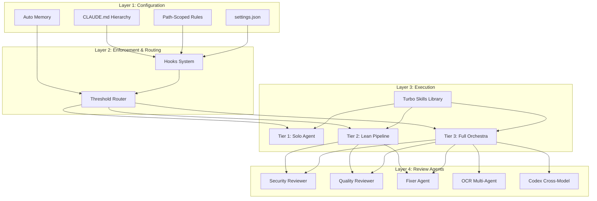
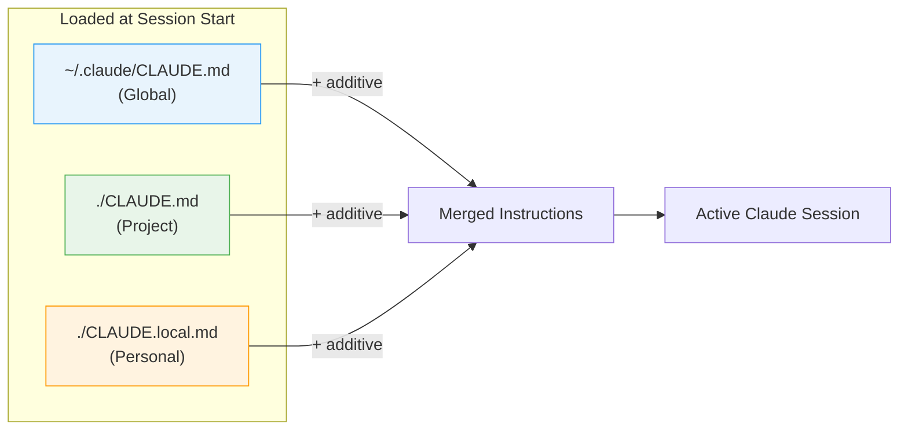
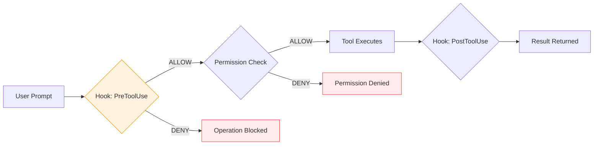
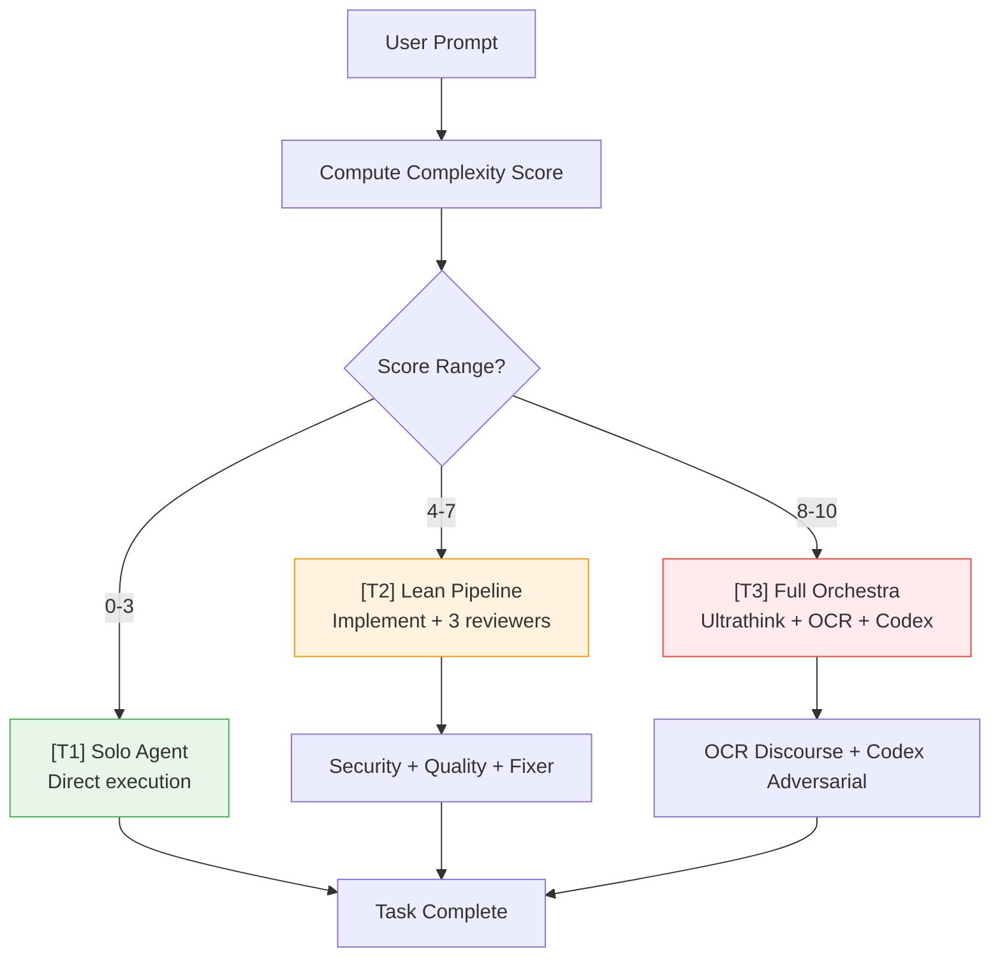
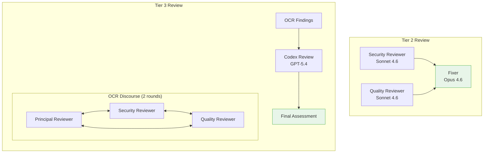

# System Architecture: Claude Code Agent Orchestration

This document explains the 4-layer architecture that powers Claude Code's agent orchestration system. If you are new to this system, think of it like a building:

- **Foundation** (Layer 1: Configuration) -- the settings and instructions that define how agents behave
- **Walls** (Layer 2: Enforcement & Routing) -- the guardrails and decision logic that keep everything safe and efficient
- **Rooms** (Layer 3: Execution) -- the actual work tiers where tasks get done
- **Inspectors** (Layer 4: Review Agents) -- the specialized reviewers that verify quality and security

Each layer builds on the one below it. You cannot have good execution without good enforcement, and you cannot have good enforcement without good configuration.

---

## Table of Contents

1. [Overview](#overview)
2. [Layer 1: Configuration](#layer-1-configuration)
3. [Layer 2: Enforcement & Routing](#layer-2-enforcement--routing)
4. [Layer 3: Execution](#layer-3-execution)
5. [Layer 4: Review Agents](#layer-4-review-agents)
6. [Component Inventory](#component-inventory)

---

## Overview

The orchestration system coordinates multiple AI agents to handle software development tasks of varying complexity. Rather than throwing the maximum number of agents at every problem (which research shows actually degrades performance), the system dynamically selects the right level of orchestration based on task complexity.

The key insight: a solo expert agent outperforms a poorly coordinated team. Multi-agent orchestration only helps when the task genuinely benefits from multiple perspectives, and when the coordination overhead is managed carefully.



---

## Layer 1: Configuration

Configuration is the foundation of the entire system. It tells Claude Code who you are, what your project looks like, and how you want it to behave. There are four components at this layer.

### CLAUDE.md Hierarchy

CLAUDE.md files are plain Markdown files that provide instructions to Claude Code. They work at three levels:

| Level | Location | Scope | Example Use |
|-------|----------|-------|-------------|
| **Global** | `~/.claude/CLAUDE.md` | All projects, all sessions | Your personal coding standards, preferred tools, verification habits |
| **Project** | `./CLAUDE.md` (repo root) | Everyone working on this project | Architecture decisions, build commands, critical constraints |
| **Personal** | `./CLAUDE.local.md` (repo root) | Just you, on this project | Your local env quirks, personal workflow preferences |

**Important**: These levels are **additive**, meaning they stack on top of each other. They do not override. If your global file says "always run tests" and your project file says "use pytest", both instructions apply. The global file is typically around 50 lines and is loaded at session start and again after every compaction (when Claude compresses older messages to free up context space).



### Rules Files

Rules are conditional instructions stored in `.claude/rules/*.md`. Each rule file has YAML frontmatter with a `paths:` field that specifies glob patterns. The rule only activates when you are editing files that match those patterns.

Example: a `security.md` rule with `paths: ["src/auth/**", "src/iam/**"]` would only load its instructions when you are working on authentication or IAM files. This keeps your context focused -- Claude does not waste tokens reading security rules when you are editing CSS.

```
.claude/
  rules/
    security.md      # paths: ["src/auth/**", "src/iam/**"]
    testing.md        # paths: ["**/*.test.*", "**/*.spec.*"]
    api-design.md     # paths: ["src/api/**", "functions/**"]
    frontend.md       # paths: ["src/components/**", "src/pages/**"]
```

### Auto Memory

Claude Code has a persistent memory system that stores learnings across sessions. When Claude discovers something about your project (a quirk, a pattern, a preference you expressed), it can save that to `~/.claude/projects/<project>/memory/`. These memories are loaded in future sessions so Claude does not have to relearn the same things.

Memory is file-based and human-readable. You can inspect, edit, or delete memory files at any time.

### settings.json

The `settings.json` file (located at `~/.claude/settings.json` for global, or `.claude/settings.json` for project-level) controls the mechanical behavior of Claude Code:

- **Model**: which Claude model to use (e.g., `claude-opus-4-6`)
- **Effort level**: how deeply Claude reasons (`low`, `medium`, `high`, `max`)
- **Permissions**: explicit allow/deny lists for tools and shell commands
- **Hooks**: shell scripts that fire on specific events (see Layer 2)
- **Auto mode config**: what Claude can do when running autonomously

---

## Layer 2: Enforcement & Routing

This layer sits between configuration and execution. It enforces safety rules and decides how complex each task is.

### Hooks System

Hooks are shell scripts that fire automatically on specific Claude Code events. There are 5 event types:

| Event | When It Fires | Common Use |
|-------|---------------|------------|
| **PreToolUse** | Before any tool executes | Block dangerous operations, validate inputs |
| **PostToolUse** | After a tool succeeds | Run formatters, log actions, trigger builds |
| **PostToolUseFail** | After a tool fails | Clean up, notify, retry logic |
| **Notification** | When Claude sends a notification | Custom alerting |
| **Stop** | When Claude finishes a turn | Final checks, summary generation |

**Key insight**: Hooks fire BEFORE permission checks. This means even in auto mode (where Claude has broad permissions to act independently), hooks can still deny dangerous operations. This is the first line of defense.



Hooks are configured in `settings.json` under the `hooks` key. Each hook specifies the event type, an optional `matcher` (to filter which tools it applies to), and the shell command to run. The hook script receives context via environment variables (tool name, input, etc.) and can return a JSON response to allow, deny, or modify the operation.

### Threshold Router

The threshold router is a skill that runs on every single prompt. It computes a complexity score (0-10) based on factors like:

- Number of files likely affected
- Whether the task involves security-sensitive code
- Whether cross-cutting architectural changes are needed
- Whether the task requires coordination across multiple systems

Based on the score, it routes to one of three tiers:



The user can override the router: saying "just do it" forces a downgrade (treat it as simpler), while "full review" forces an upgrade to T3 regardless of score.

---

## Layer 3: Execution

This is where the actual work happens. Each tier represents a different level of orchestration.

### Tier 1: Solo Agent (Score 0-3)

The simplest tier. A single Opus 4.6 agent handles the task directly with `/effort medium`. This is appropriate for:

- Simple bug fixes
- Small refactors
- Documentation updates
- Straightforward feature additions

No subagents are spawned. The agent reads files, makes changes, and runs verification (type checker, tests) on its own. Most day-to-day development tasks fall here.

### Tier 2: Lean Pipeline (Score 4-7)

The agent implements the changes first, then spawns 3 subagents in parallel for review:

1. **Security Reviewer** -- checks for vulnerabilities
2. **Quality Reviewer** -- checks for code quality issues
3. **Fixer** -- evaluates findings and applies fixes

This tier is for tasks like:

- Multi-file feature implementations
- API endpoint additions
- Database schema changes
- Anything touching authentication or authorization

The implementation-first approach is intentional. The primary agent has full context from the conversation, so it implements while that context is fresh. Reviewers then check the work with specialized lenses.

### Tier 3: Full Orchestra (Score 8+)

The maximum orchestration level. The workflow is:

1. **Ultrathink Planning** -- deep reasoning to produce a detailed plan before any code is written
2. **Implementation** -- execute the plan with full verification
3. **OCR Multi-Agent Discourse** -- multiple reviewer agents debate the changes over 2 rounds
4. **Codex Cross-Model Review** -- a different AI model (GPT-5.4) reviews the code to catch blind spots that same-model reasoning might miss

This tier is reserved for:

- Major architectural changes
- Security-critical implementations
- Cross-cutting refactors affecting many files
- New system integrations

### Turbo Skills

Turbo skills are reusable workflow scripts (60+) stored in `.claude/skills/`. They are composable building blocks that any tier can invoke. Examples:

| Skill | What It Does |
|-------|-------------|
| `/finalize` | Post-implementation quality pipeline (format, lint, test, review) |
| `/review-code` | Full code review with test coverage + quality + security |
| `/self-improve` | Extract lessons from the current session into reusable rules |
| `/ship` | Commit, push, and optionally create/update a PR |
| `/investigate` | Systematic debugging with hypothesis testing |
| `/create-spec` | Collaborative specification writing |
| `/audit` | Project-wide health audit |

Skills are invoked with a slash command (e.g., `/finalize`) and can call other skills. They are the primary mechanism for building repeatable workflows.

---

## Layer 4: Review Agents

Review agents are specialized subagents that check work product for specific categories of issues. They are spawned by Tier 2 and Tier 3 execution.

### Security Reviewer

- **Model**: Sonnet 4.6
- **Access**: Read-only, worktree isolation (cannot modify the main repo)
- **Focus**: Credential exposure, IAM policy violations, injection risks, dependency vulnerabilities
- **Output**: List of findings with severity ratings and remediation suggestions

The security reviewer runs in a Git worktree, which is an isolated copy of the repository. This means even if the reviewer's instructions were somehow manipulated, it cannot modify your actual code.

### Quality Reviewer

- **Model**: Sonnet 4.6
- **Access**: Read-only, worktree isolation
- **Focus**: KISS (Keep It Simple), DRY (Don't Repeat Yourself), Separation of Concerns, test coverage, naming conventions, code clarity
- **Output**: List of findings with severity ratings and improvement suggestions

### Fixer Agent

- **Model**: Opus 4.6
- **Access**: Write access + test runner
- **Role**: Evaluates findings from both reviewers, steelmans each finding (gives it the strongest possible interpretation before deciding), then makes a verdict:
  - **ACCEPT** -- the finding is valid, apply the fix
  - **REJECT** -- the finding is a false positive or not worth the trade-off
  - **DEFER** -- the finding is valid but should be addressed separately (different scope, different PR)

The fixer is deliberately a more capable model (Opus vs Sonnet) because evaluating findings requires deeper reasoning than generating them.

### OCR Multi-Agent Discourse (Tier 3 only)

OCR (Open Code Review) runs a structured debate between multiple reviewer personas:

1. **Principal Reviewer** -- overall code quality and architecture
2. **Security Reviewer** -- security-focused analysis
3. **Quality Reviewer** -- maintainability and best practices

These reviewers engage in 2 rounds of discourse, where they can challenge each other's findings, raise new concerns based on other reviewers' observations, and converge on a final assessment. This debate format catches issues that a single-pass review would miss.

### Codex Cross-Model Review (Tier 3 only)

After the OCR discourse, the changes are sent to OpenAI's Codex CLI (GPT-5.4) for an adversarial review. The purpose is to catch blind spots from same-model reasoning -- if Claude Opus generated the code and Claude Sonnet reviewed it, they may share similar reasoning patterns. A completely different model architecture provides a genuinely independent perspective.



---

## Component Inventory

The following table lists every component in the orchestration system.

| Component | Type | Location | Model | Approx. Token Cost | Trigger |
|-----------|------|----------|-------|-------------------|---------|
| CLAUDE.md (Global) | Config | `~/.claude/CLAUDE.md` | N/A | ~200 tokens | Session start, compaction |
| CLAUDE.md (Project) | Config | `./CLAUDE.md` | N/A | Varies | Session start, compaction |
| CLAUDE.md (Personal) | Config | `./CLAUDE.local.md` | N/A | Varies | Session start, compaction |
| Path-Scoped Rules | Config | `.claude/rules/*.md` | N/A | ~100-500 tokens each | File edit matching glob |
| Auto Memory | Config | `~/.claude/projects/*/memory/` | N/A | Varies | Session start |
| settings.json | Config | `~/.claude/settings.json` | N/A | N/A (parsed, not injected) | Session start |
| PreToolUse Hook | Hook | `settings.json` hooks config | N/A | ~50 tokens overhead | Before any tool call |
| PostToolUse Hook | Hook | `settings.json` hooks config | N/A | ~50 tokens overhead | After successful tool call |
| PostToolUseFail Hook | Hook | `settings.json` hooks config | N/A | ~50 tokens overhead | After failed tool call |
| Notification Hook | Hook | `settings.json` hooks config | N/A | ~50 tokens overhead | On notification |
| Stop Hook | Hook | `settings.json` hooks config | N/A | ~50 tokens overhead | On turn completion |
| Threshold Router | Skill | `.claude/skills/threshold-router.md` | Opus 4.6 | ~500 tokens | Every prompt |
| Tier 1 Execution | Agent | Main session | Opus 4.6 | 5K-50K tokens | Score 0-3 |
| Tier 2 Execution | Agent | Main session + subagents | Opus 4.6 + 2x Sonnet 4.6 | 50K-200K tokens | Score 4-7 |
| Tier 3 Execution | Agent | Main + subagents + external | Opus 4.6 + Sonnet 4.6 + GPT-5.4 | 200K-500K tokens | Score 8+ |
| Security Reviewer | Subagent | Git worktree | Sonnet 4.6 | 10K-30K tokens | T2/T3 review phase |
| Quality Reviewer | Subagent | Git worktree | Sonnet 4.6 | 10K-30K tokens | T2/T3 review phase |
| Fixer | Subagent | Main worktree | Opus 4.6 | 15K-50K tokens | T2/T3 after reviews |
| OCR Plugin | Plugin | `.claude/plugins/ocr/` | Configurable | 50K-150K tokens | T3 review, `/ocr:review` |
| Codex Plugin | Plugin | `.claude/plugins/codex/` | GPT-5.4 | 20K-80K tokens | T3 review, `/codex-review` |
| Turbo Skills (60+) | Skill | `.claude/skills/*.md` | Opus 4.6 | 200-2K tokens each | Slash command invocation |
| MCP Servers | MCP | `.claude/settings.json` | N/A | Varies per call | Tool invocation |

**Token cost notes**:
- Costs are approximate and vary significantly based on codebase size and task complexity.
- Prompt caching reduces repeated context costs by approximately 92% (cache hit rate).
- Sonnet 4.6 is used for reviewers because it costs 60% less than Opus 4.6 while being sufficient for focused review tasks.
- The total cost for a T3 task (full orchestra) can reach 500K+ tokens, which is why the threshold router exists -- you only pay that cost when the task genuinely warrants it.
