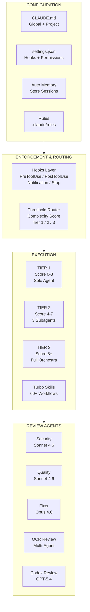

# Claude Code Agent Orchestration Guide

[](LICENSE)
[](#environment-decisions)
[](#environment-decisions)

A step-by-step guide to building a multi-agent orchestration system for [Claude Code](https://claude.ai/code). This repository transforms a 41-page implementation runbook into actionable automation scripts, config templates, interactive tutorials, and reference documentation. It is written for IT professionals with approximately 1 year of GitHub experience who want to set up a production-grade AI-assisted development workflow from scratch.

## System Architecture



> For a detailed breakdown of each layer, see [ARCHITECTURE.md](ARCHITECTURE.md).

## Reading Order

Follow these phases in order. Each phase builds on the previous one.

| # | Phase | What You'll Do | Time |
|---|-------|----------------|------|
| 0 | [Pre-Flight Checks](phase-00-preflight/) | Install tools, configure environment | 30 min |
| 1 | [Core Configuration](phase-01-core-config/) | Create CLAUDE.md, rules, memory | 1-2 hrs |
| 2 | [Hooks System](phase-02-hooks-system/) | Set up security hooks and auto-format | 1 hr |
| 3 | [Threshold Router](phase-03-threshold-router/) | Build the complexity scoring engine | 2-3 hrs |
| 4 | [Turbo Skills + MCP](phase-04-turbo-skills/) | Install 60+ workflow skills and MCP servers | 1-2 hrs |
| 5 | [Open Code Review](phase-05-open-code-review/) | Add multi-agent code review plugin | 30 min |
| 6 | [Codex Plugin](phase-06-codex-plugin/) | Add cross-model adversarial review | 30 min |
| 7 | [Custom Subagents](phase-07-custom-subagents/) | Create security, quality, and fixer agents | 1-2 hrs |
| 8 | [Skills Library](phase-08-skills-library/) | Build workload-specific skills | 1-2 hrs |
| 9 | [Auto Mode](phase-09-auto-mode/) | Enable autonomous operation with guardrails | 30 min |
| 10 | [Integration Testing](phase-10-integration-testing/) | Verify the complete system works | 1-2 hrs |

**Total estimated time: 14-17 hours** (can be spread across multiple sessions).

> **Phases 0-3 must be completed in order** (each depends on the previous). After Phase 3, Phases 4-6 can be done in parallel. Phase 9 requires Phases 7 and 8. Phase 10 requires all others. See [diagrams/phase-dependency-graph.md](diagrams/phase-dependency-graph.md) for the visual dependency map.

## Quick Start

```bash
# 1. Clone this repository
git clone https://github.com/nathan-hayashi/claude-agent-orchestration-guide.git
cd claude-agent-orchestration-guide

# 2. Run the pre-flight check (Stage 1: before installing Claude Code)
./phase-00-preflight/preflight-check.sh --pre

# 3. Install Claude Code (if not already installed)
./phase-00-preflight/install-claude-code.sh

# 4. Run the pre-flight check (Stage 2: after installing Claude Code)
./phase-00-preflight/preflight-check.sh --post

# 5. Continue with Phase 0's remaining scripts, then Phase 1, 2, 3...
```

## File Structure

```
claude-agent-orchestration-guide/
├── README.md                          # You are here
├── ARCHITECTURE.md                    # System architecture deep-dive
├── GLOSSARY.md                        # Key terms and concepts
├── REFERENCES.md                      # 31 academic and industry citations
├── PROGRESS.md                        # Implementation checkpoint tracker
├── LICENSE                            # MIT License
├── .gitignore                         # Secrets and artifact protection
│
├── phase-00-preflight/                # Phase 0: Pre-Flight Checks
│   ├── README.md
│   ├── preflight-check.sh            #   Two-stage environment validator
│   ├── install-claude-code.sh         #   Claude Code installer
│   ├── setup-git-config.sh           #   Git configuration
│   ├── setup-wsl-memory.sh           #   WSL memory allocation
│   ├── setup-notifications.sh        #   Desktop notifications
│   ├── setup-directories.sh          #   Directory structure
│   ├── setup-shell-env.sh            #   Prettier + env vars
│   └── configs/                      #   Example config files
│
├── phase-01-core-config/             # Phase 1: Core Configuration
│   ├── README.md
│   ├── create-claude-md.sh           #   CLAUDE.md generator
│   ├── create-rules.sh               #   Path-scoped rules
│   ├── setup-memory.sh               #   Memory + rules symlink
│   └── configs/                      #   CLAUDE.md + rules examples
│
├── phase-02-hooks-system/            # Phase 2: Hooks System
│   ├── README.md
│   ├── create-settings-json.sh       #   Full settings.json generator
│   ├── test-hooks.sh                 #   Configuration validator
│   └── configs/                      #   settings.json + hook examples
│
├── phase-03-threshold-router/        # Phase 3: Threshold Router
│   ├── README.md
│   ├── create-threshold-skill.sh     #   Threshold skill installer
│   ├── test-threshold.sh             #   Threshold validator
│   └── configs/                      #   Skill definition example
│
├── phase-04-turbo-skills/            # Phase 4: Turbo Skills + MCP
│   ├── README.md
│   ├── install-turbo.sh              #   Turbo plugin installer
│   ├── setup-mcp-servers.sh          #   MCP server configuration
│   └── configs/                      #   .mcp.json example
│
├── phase-05-open-code-review/        # Phase 5: Open Code Review
│   ├── README.md
│   ├── install-ocr.sh                #   OCR plugin installer
│   └── configs/                      #   Team config example
│
├── phase-06-codex-plugin/            # Phase 6: Codex Plugin
│   ├── README.md
│   └── install-codex.sh              #   Codex installer
│
├── phase-07-custom-subagents/        # Phase 7: Custom Subagents
│   ├── README.md
│   ├── create-subagents.sh           #   Agent definition creator
│   └── configs/agents/               #   Agent definition examples
│
├── phase-08-skills-library/          # Phase 8: Skills Library
│   ├── README.md
│   ├── create-custom-skills.sh       #   Custom skill creator
│   └── configs/skills/               #   Skill definition examples
│
├── phase-09-auto-mode/               # Phase 9: Auto Mode
│   ├── README.md
│   ├── enable-auto-mode.sh           #   Auto mode enabler
│   └── configs/                      #   Auto mode settings example
│
├── phase-10-integration-testing/     # Phase 10: Integration Testing
│   ├── README.md
│   ├── run-integration-tests.sh      #   Test orchestrator
│   └── test-cases.sh                 #   10 individual test functions
│
├── scripts/                          # Automation utilities
│   ├── platform-detect.sh            #   WSL/macOS detection (sourced by all)
│   ├── new-project.sh                #   Auto-bootstrap for new repos
│   ├── clone-wrapper.sh              #   Git clone + auto-setup function
│   ├── check-project.sh              #   Health check for any project
│   └── validate-repo.sh              #   Pre-push repo validator
│
├── diagrams/                         # Visual diagrams (Mermaid)
│   ├── system-architecture.md        #   4-layer architecture
│   ├── config-hierarchy.md           #   Config precedence levels
│   ├── threshold-flowchart.md        #   Scoring and routing logic
│   ├── token-economics.md            #   Cost comparison
│   ├── before-after-workflow.md      #   Manual vs orchestrated review
│   ├── decision-matrix.md            #   Workload-to-pattern mapping
│   ├── phase-dependency-graph.md     #   Phase ordering constraints
│   ├── gantt-chart.md                #   Implementation timeline
│   ├── error-resolution.md           #   Common failures and fixes
│   └── component-inventory.md        #   Full component table
│
└── tutorial/                         # Interactive tutorial
    ├── README.md                     #   Tutorial landing page
    ├── 01-hello-pets.md              #   Exercise 1: First project
    ├── 02-guard-the-kennel.md        #   Exercise 2: Hooks
    ├── 03-sort-the-litter.md         #   Exercise 3: Threshold router
    ├── 04-fetch-skills.md            #   Exercise 4: Skills + MCP
    ├── 05-breed-the-agents.md        #   Exercise 5: Subagents
    ├── 06-auto-walkies.md            #   Exercise 6: Auto mode
    ├── 07-vet-checkup.md             #   Exercise 7: Integration tests
    └── assets/sample-project/        #   Starter files for exercises
        ├── pets.json
        ├── CLAUDE.md
        └── README.md
```

## Environment Decisions

| Component | Recommended | Why |
|-----------|-------------|-----|
| OS | Windows 11 WSL 2 (Ubuntu 24.04) or macOS (Apple Silicon) | Native Linux performance on Windows. All scripts support both platforms. |
| Node.js | v20+ | Required by Claude Code. Use the LTS version. |
| npm | v9+ | Ships with Node.js. Used for global tool installs. |
| Claude Code | v2.1.92+ | The AI coding assistant this guide configures. Install via native installer. |
| Model | Claude Opus 4.6 | Most capable model. Used as the primary agent for all tiers. |
| Subscription | Claude Max | Required for multi-agent dispatch. Prompt caching reduces costs by ~90%. |

## Who Does What: User vs AI

| Step | You (Human) | AI Assistant |
|------|-------------|--------------|
| Run install scripts | Execute the `.sh` scripts | N/A (scripts are manual) |
| Create CLAUDE.md | Review and customize the template | Reads it every session |
| Configure hooks | Run the generator script | Hooks fire automatically |
| Set up threshold router | Install the skill file | Routes every prompt automatically |
| Install plugins | Run install commands in Claude Code | Plugins extend capabilities |
| Create subagents | Run the creator script | Spawns agents during T2+ tasks |
| Write code | Describe what you want | Implements, reviews, fixes |
| Review agent findings | Accept/reject/defer findings | Presents findings with evidence |
| Run integration tests | Execute the test script | N/A (tests are automated checks) |

## AI Assistant Recommendation

This guide was built with and for **[Claude Code](https://claude.ai/code)** using a **Claude Max** subscription. The hooks system, skills, subagents, threshold router, and MCP integrations are Claude Code-specific features.

**We strongly recommend using Claude Code alongside this guide.** When you encounter unfamiliar concepts, get stuck on a step, or need help debugging, your Claude Code session can:
- Explain what each configuration does and why
- Help troubleshoot errors (this guide documents 12 known errors with fixes)
- Suggest improvements to your specific setup
- Review your code using the multi-agent pipeline you build

Other AI coding assistants (GitHub Copilot, Cursor, etc.) can help with general coding but cannot use the orchestration features documented here.

## Interactive Tutorial

New to Claude Code? Start with the **[PetShelter Tutorial](tutorial/)** after completing Phases 0-1. It walks you through each concept using a fun dogs-and-cats project with hands-on exercises.

## Diagrams

All 10 diagrams render directly on GitHub using Mermaid:

| Diagram | What It Shows |
|---------|---------------|
| [System Architecture](diagrams/system-architecture.md) | 4-layer orchestration system overview |
| [Config Hierarchy](diagrams/config-hierarchy.md) | 6-level configuration precedence |
| [Threshold Flowchart](diagrams/threshold-flowchart.md) | Complexity scoring and tier routing |
| [Token Economics](diagrams/token-economics.md) | Cost comparison: single vs multi-agent |
| [Before/After Workflow](diagrams/before-after-workflow.md) | Manual review vs orchestrated review |
| [Decision Matrix](diagrams/decision-matrix.md) | Which patterns fit which workloads |
| [Phase Dependencies](diagrams/phase-dependency-graph.md) | Phase ordering constraints |
| [Gantt Chart](diagrams/gantt-chart.md) | Implementation timeline |
| [Error Resolution](diagrams/error-resolution.md) | 6 common failures with fixes |
| [Component Inventory](diagrams/component-inventory.md) | Full system component table |

## Troubleshooting

This guide documents **12 errors** encountered during the original implementation session. Each error includes the root cause and exact fix:

- **Phase 2 errors**: Model field ANSI corruption, autoMode.environment type mismatch, invalid JSON syntax
- **Phase 3 errors**: Threshold router not firing on T1/T2 tasks
- **Phase 4 errors**: Turbo writing to global CLAUDE.md, /plugin add opening browser
- **Phase 7 errors**: Wrong frontmatter field names (`allowed-tools` vs `tools`, `memory-scope` vs `memory`)
- **Post-implementation errors**: Rules path not detected, Git attribution quoting, GitHub push protection, corrupted settings.json

See each phase's README for detailed error documentation, or run the [integration tests](phase-10-integration-testing/) to verify your setup.

## References

This guide is grounded in academic research, industry surveys, and official documentation. See [REFERENCES.md](REFERENCES.md) for all 31 citations, including:

- Google DeepMind's multi-agent performance boundaries research
- Stack Overflow and JetBrains developer surveys on AI tool adoption
- Anthropic's official Claude Code best practices
- Token economics and prompt caching documentation

## License

[MIT](LICENSE) -- Nathan Lim, 2026
