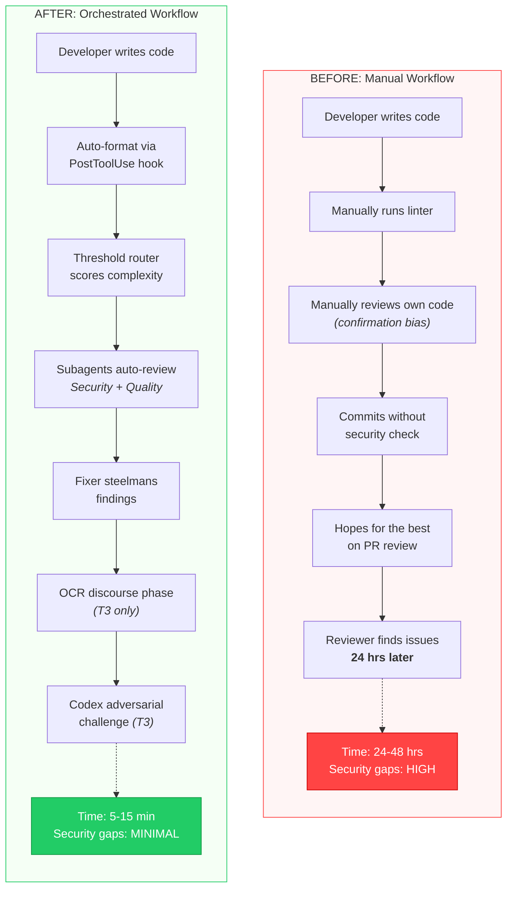

# Before vs After Workflow

The manual workflow relies on the developer to self-review and catch issues, introducing confirmation bias and leaving security gaps until a human reviewer is available hours or days later. The orchestrated workflow automates formatting, scoring, and multi-agent review within minutes, catching security and quality issues before they ever reach a human reviewer. The T3 tier adds OCR multi-persona discourse and Codex adversarial challenge for the highest-risk changes.
