# Component Inventory

```mermaid
flowchart TD
    subgraph SKILLS["Skills"]
        direction TB
        SK1["<b>threshold-router</b><br/>Type: Skill<br/>Location: .claude/skills/<br/>Model: Opus 4.6<br/>Trigger: Every prompt"]
        SK2["<b>terraform-iac</b><br/>Type: Skill<br/>Location: .claude/skills/<br/>Model: Opus 4.6<br/>Trigger: .tf files"]
        SK3["<b>docker-compose</b><br/>Type: Skill<br/>Location: .claude/skills/<br/>Model: Opus 4.6<br/>Trigger: Docker files"]
        SK4["<b>powershell-style</b><br/>Type: Skill<br/>Location: .claude/skills/<br/>Model: Opus 4.6<br/>Trigger: .ps1 files"]
    end

    subgraph AGENTS["Review Agents"]
        direction TB
        AG1["<b>security-reviewer</b><br/>Type: Agent<br/>Location: Subagent<br/>Model: Sonnet 4.6<br/>Trigger: T2+ tasks"]
        AG2["<b>quality-reviewer</b><br/>Type: Agent<br/>Location: Subagent<br/>Model: Sonnet 4.6<br/>Trigger: T2+ tasks"]
        AG3["<b>fixer</b><br/>Type: Agent<br/>Location: Subagent<br/>Model: Opus 4.6<br/>Trigger: After reviewers"]
    end

    subgraph HOOKS["Hooks"]
        direction TB
        HK1["<b>Bash blocker</b><br/>Type: PreToolUse<br/>Location: settings.json<br/>Trigger: rm -rf, force push"]
        HK2["<b>Sensitive guard</b><br/>Type: PreToolUse<br/>Location: settings.json<br/>Trigger: .env, secrets"]
        HK3["<b>Auto-format</b><br/>Type: PostToolUse<br/>Location: settings.json<br/>Trigger: File write"]
        HK4["<b>Error recovery</b><br/>Type: PostToolUse<br/>Location: settings.json<br/>Trigger: Tool failure"]
        HK5["<b>Git attribution</b><br/>Type: PreToolUse<br/>Location: settings.json<br/>Trigger: git commit"]
        HK6["<b>Win notification</b><br/>Type: Notification<br/>Location: settings.json<br/>Trigger: Task complete"]
    end

    subgraph PLUGINS["Plugins & MCP"]
        direction TB
        PL1["<b>Turbo /finalize</b><br/>Type: Plugin<br/>Model: Opus 4.6<br/>Trigger: /finalize"]
        PL2["<b>Turbo /review-code</b><br/>Type: Plugin<br/>Model: Opus 4.6<br/>Trigger: /review-code"]
        PL3["<b>OCR /ocr:review</b><br/>Type: Plugin<br/>Model: Multi-Agent<br/>Trigger: /ocr:review"]
        PL4["<b>Codex</b><br/>Type: Plugin<br/>Model: GPT-5.4<br/>Trigger: /codex-review"]
        PL5["<b>sequential-thinking</b><br/>Type: MCP Server<br/>Trigger: Complex reasoning"]
        PL6["<b>github</b><br/>Type: MCP Server<br/>Trigger: GH operations"]
    end

    style SKILLS fill:#e8f5e9,stroke:#4caf50
    style AGENTS fill:#e3f2fd,stroke:#2196f3
    style HOOKS fill:#fff3e0,stroke:#ff9800
    style PLUGINS fill:#f3e5f5,stroke:#9c27b0
```

This inventory catalogs all 19 orchestration components organized by type: 4 skills for domain-specific workflows, 3 review agents for automated code analysis, 6 hooks for enforcement guardrails, and 6 plugins/MCP servers for extended capabilities. Each component lists its runtime model, file location, and activation trigger. The threshold-router skill is unique in that it fires on every prompt, while all other components activate conditionally based on file types, task tiers, or explicit invocation.
