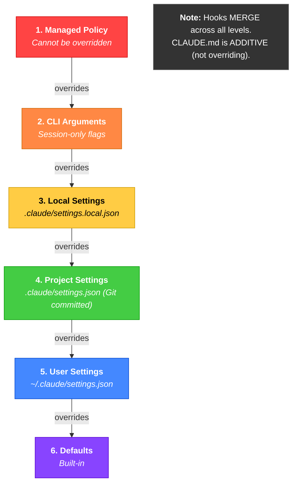

# Configuration Hierarchy

Configuration follows a strict 6-level precedence where higher levels override lower ones. Managed Policy at the top cannot be overridden by anything below it, while built-in defaults serve as the baseline. The key exception is that hooks merge across all levels rather than replacing, and CLAUDE.md instructions are additive -- they accumulate from every level rather than overriding.
