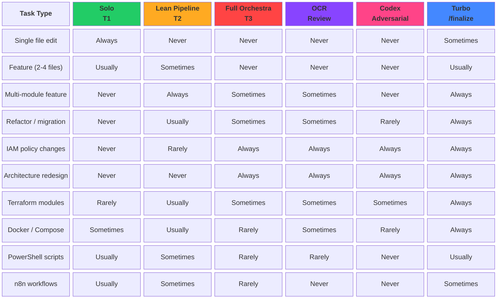

# Decision Matrix

This matrix maps ten common task types to six orchestration components, indicating how frequently each component is engaged. Simple edits stay in T1 solo mode, while security-sensitive work like IAM policies always escalates to the full T3 orchestra with OCR and Codex adversarial review. The Turbo /finalize step is used for nearly every task type that touches more than a single file.
