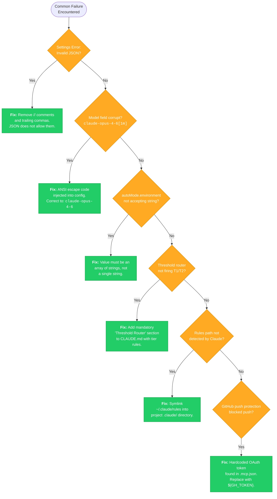

# Error Resolution Flowchart

These six errors represent the most common failure modes encountered during orchestration setup. Each one has a specific root cause and a deterministic fix -- no guesswork required. The ANSI escape code corruption (error 2) and the GitHub push protection block (error 6) are particularly insidious because they silently modify config values or block operations without obvious error messages pointing to the real cause.
