# Implementation Timeline

```mermaid
gantt
    title Orchestration Build Timeline (~14-17 hours)
    dateFormat HH:mm
    axisFormat %H:%M

    section Sequential Gate
    P0 Pre-Flight             :p0, 00:00, 30m
    P1 CLAUDE.md + Config     :p1, after p0, 2h
    P2 Hooks System           :p2, after p1, 1h
    P3 Threshold Engine       :p3, after p2, 2h30m

    section Parallel Track A
    P4 Turbo Skills           :p4, after p3, 2h

    section Parallel Track B
    P5 OCR Integration        :p5, after p3, 1h
    P6 Codex Integration      :p6, after p5, 1h

    section Parallel Track C
    P7 Custom Subagents       :p7, after p3, 2h
    P8 Skills Library         :p8, after p3, 2h30m

    section Final
    P9 Auto Mode              :p9, after p7, 30m
    P10 Integration Test      :crit, p10, after p9, 2h
```

The build follows a critical path of roughly 14-17 hours depending on parallelization. The first 6 hours are sequential (P0 through P3), establishing the foundation that all later phases depend on. After the Threshold Engine is operational, three parallel tracks execute simultaneously -- Turbo Skills, OCR/Codex integrations, and Subagents/Skills Library -- before converging at Auto Mode and the final integration test.
