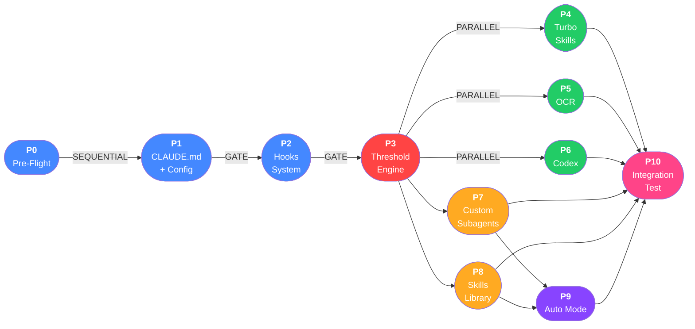

# Phase Dependency Graph

Phases P0 through P3 form a strict sequential gate -- each must complete before the next begins, as later phases depend on the configuration and infrastructure established earlier. After P3 (Threshold Engine), phases P4, P5, and P6 can execute in parallel since they are independent integration targets. Phase P9 (Auto Mode) requires both P7 (Custom Subagents) and P8 (Skills Library), while P10 (Integration Test) cannot begin until every other phase has completed.
