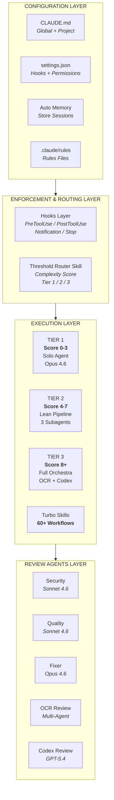

# System Architecture

The orchestration system is organized into four layers that flow top-to-bottom. Configuration feeds into enforcement and routing, which determines the execution tier, which then dispatches to the appropriate review agents. Each layer is independently configurable and the tier selection governs how many review agents participate in any given task.
