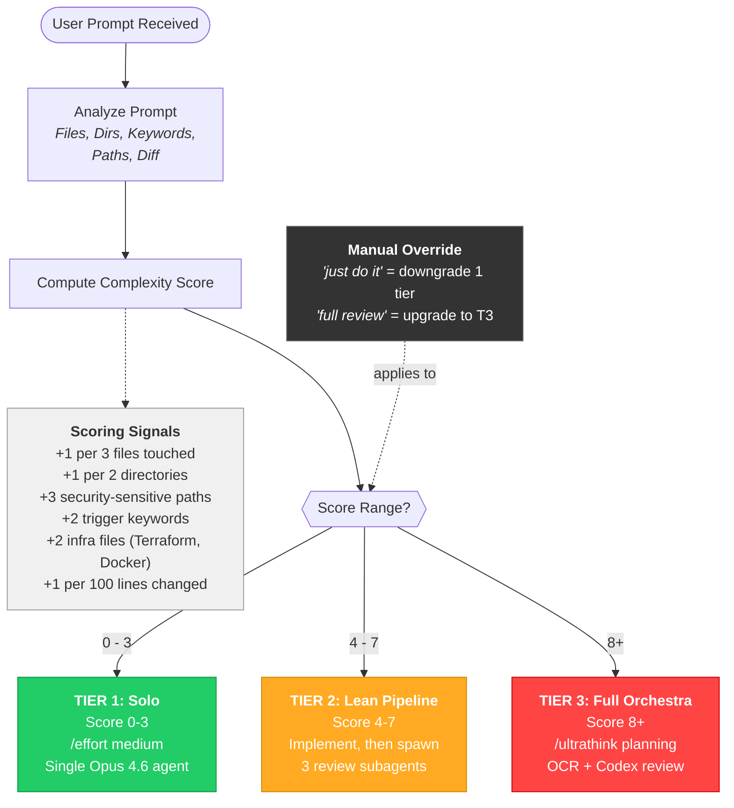

# Threshold Escalation Flowchart

Every user prompt is analyzed for complexity signals before any work begins. The scoring formula weighs file count, directory spread, security sensitivity, and change volume to produce a numeric score. That score determines which tier executes the task, though users can manually override with "just do it" (downgrade) or "full review" (force T3).
