# Token Economics

```mermaid
flowchart LR
    subgraph STRATEGIES["Agent Strategies Compared"]
        direction TB
        S1["<b>Single Agent</b><br/>1.0x input | 1.0x output"]
        S2["<b>3 Independent Agents</b><br/>3.0x input | 3.0x output"]
        S3["<b>3 Forked Agents (Cached)</b><br/>1.2x input | 3.0x output<br/><i>2.4x savings vs independent</i>"]
    end

    subgraph CACHE["Cache Economics"]
        direction TB
        HIT["Cache Hit: ~92%<br/>Cost: <b>0.1x</b> per token"]
        MISS["Cache Miss: ~8%<br/>Cost: <b>1.0x</b> per token"]
    end

    subgraph PRICING["Model Pricing (per M tokens)"]
        direction TB
        OPUS["<b>Opus 4.6</b><br/>Input: $5 | Output: $25"]
        SONNET["<b>Sonnet 4.6</b><br/>Input: $3 | Output: $15"]
        HAIKU["<b>Haiku 4.5</b><br/>Input: $1 | Output: $5"]
    end

    S1 --- S2
    S2 --- S3
    S3 -.->|"enabled by"| CACHE
    CACHE -.->|"applied to"| PRICING

    style S3 fill:#22cc66,color:#fff,stroke:#119944
    style HIT fill:#22cc66,color:#fff,stroke:#119944
    style MISS fill:#ff4444,color:#fff,stroke:#cc0000
```

Forking agents from a shared context enables prompt caching, which delivers roughly 2.4x cost savings compared to spinning up fully independent agents. With a 92% cache hit rate at one-tenth the normal token cost, the forked strategy makes multi-agent review economically viable. The tiered model pricing further optimizes cost by reserving expensive Opus for orchestration and fixer roles while using cheaper Sonnet for parallel review subagents.
